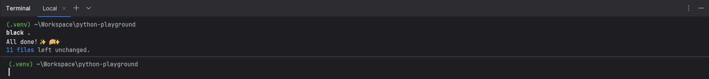
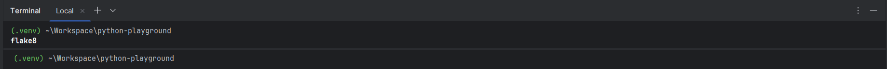
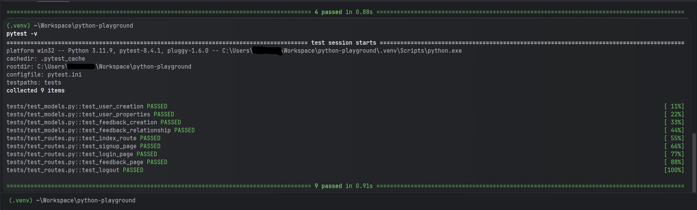
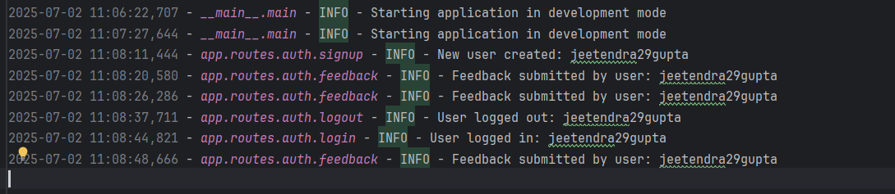
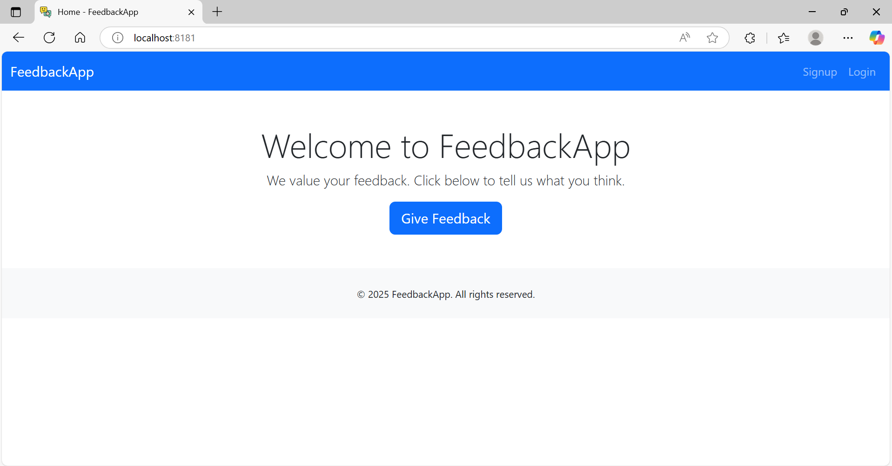
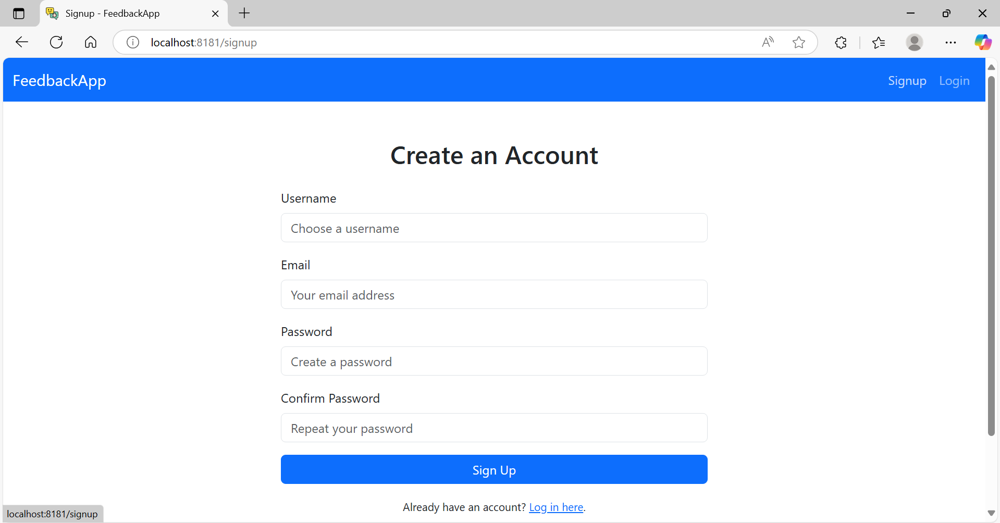
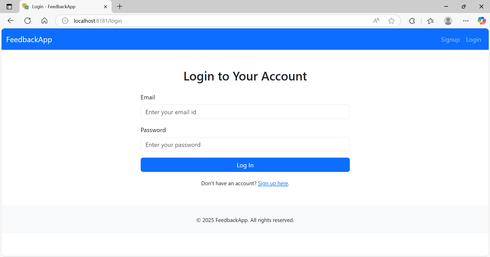
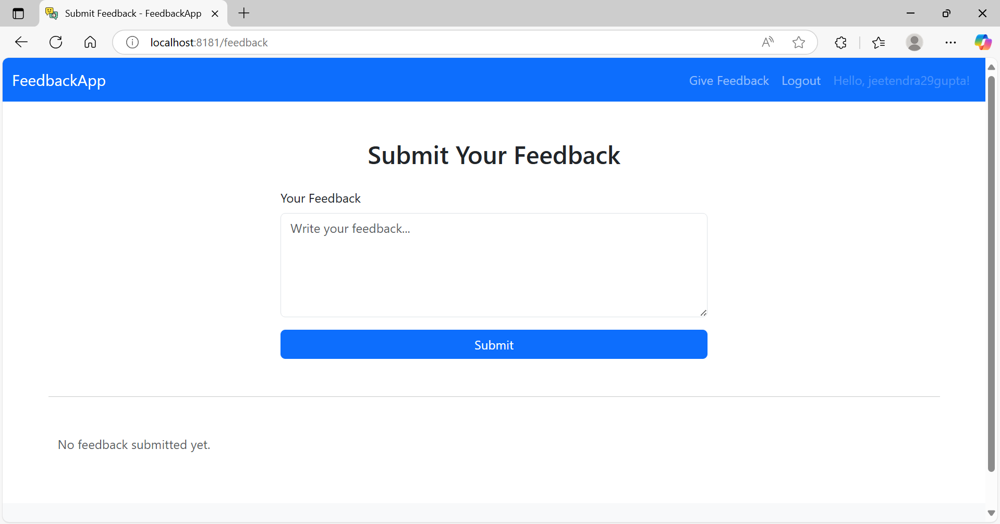
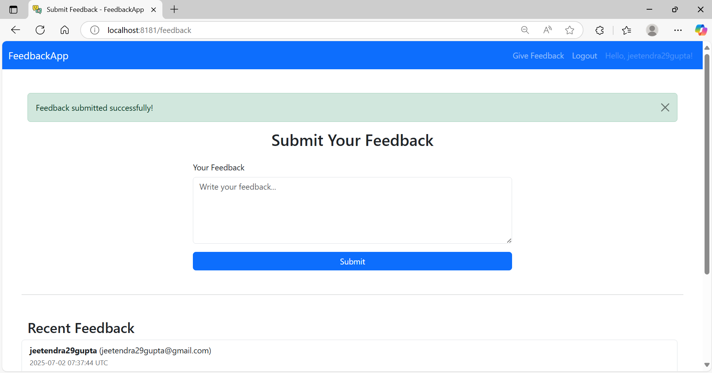

# Flask User Feedback Application

---

## Table of Contents

* [Project Overview](#project-overview)
* [Features](#features)
* [Prerequisites](#prerequisites)
* [Installation & Setup](#installation--setup)
* [Running the Application](#running-the-application)
* [Running Tests](#running-tests)
* [Logging](#logging)
* [Deployment Notes](#deployment-notes)
* [Project Structure](#project-structure)

---

## Project Overview

This is a robust Flask web application that demonstrates user management, authentication, feedback collection, and role-based access features. It is built with scalability and maintainability in mind, integrating:

* User Signup/Login with Flask-Login and Flask-Bcrypt 
* Password complexity enforced (min 8 chars, uppercase, special char, digit)
* Feedback form linked to logged-in user 
* Flash message feedback for all user actions 
* CSRF protection with Flask-WTF 
* SQLAlchemy ORM for database interactions and db session management
* Route protection using login\_required decorator 
* Bootstrap 5 for polished responsive design 
* Environment variable management with python-dotenv 
* Custom 404 and 500 error pages with logging 
* Session tracking for logged-in users 
* Cross-Origin Resource Sharing (CORS) with flask-cors 
* Testing ready with pytest, Comprehensive unit and integration tests 
* Production-ready with Gunicorn support 
* Logging with rotating files and configurable levels 
* Code quality tools: Black for formatting, Flake8 for linting
* Configuration management using environment variables


The project follows best practices in code quality, formatting (Black, Flake8), and is prepared for production deployments.

---

## Features

* User signup, login, logout
* Password hashing and authentication
* User profile management
* Feedback submission and viewing
* Admin user support
* Logging with configurable levels
* Unit and integration tests

---

## Prerequisites

Make sure you have the following installed:

* Python 3.11+
* `pip` package manager
* A virtual environment tool (e.g., `venv`)
* A relational database (PostgreSQL, MySQL, or SQLite for testing)

---

## Installation & Setup

1. **Clone the repository**

   ```bash
   git clone https://github.com/jeetendra29gupta/Flask-User-Interactions-Feebback-App.git
   cd Flask-User-Interactions-Feebback-App
   ```

2. **Create and activate a virtual environment**

   ```bash
   python -m venv .venv
   source .venv/bin/activate     # Linux/macOS
   .venv\Scripts\activate        # Windows
   ```

3. **Install dependencies**

   ```bash
   pip install -r requirements.txt
   ```

4. **Set up environment variables**
   Create a `.env` file in the project root with the following variables:

   ```env
   # Application environment: development or production
   APP_ENV=development
   
   # Flask secret key for session security and CSRF protection
   SECRET_KEY=your-very-secure-secret-key
   
   # Database URL - can be sqlite or any SQLAlchemy supported DB
   DATABASE_URL=sqlite:///user-feedback.db
   
   # Host and port your Flask app will run on
   HOST=0.0.0.0
   PORT=8181
   
   # Logger Configuration
   LOG_DIR=logs
   LOG_FILE=user-feedback.log

   ```

---

## Running the Application

### Development

```bash
python main.py
```

> **Note:** In production, use a WSGI server like `gunicorn` (Linux/macOS only) to run the app.

### Production (Linux/macOS)

```bash
gunicorn -w 4 -b 0.0.0.0:8181 main:app
```

Open browser at: (http://127.0.0.1:8181)

---

## Running Tests

This project uses `pytest` for testing.

1. Activate your virtual environment
2. Run tests from project root:

```bash
pytest -v
```

This runs all tests under the `/tests` directory, including model, route, and integration tests.

---

## Logging

Logs are stored in the directory specified by `LOG_DIR` with rotation:

* Max size: 1 MB per file
* Backup count: 5

Log format:

```
%(asctime)s - %(name)s.%(funcName)s - %(levelname)s - %(message)s
```

---

## Deployment Notes

* Ensure environment variables are securely set on the server
* Use a production-ready database server (PostgreSQL/MySQL) instead of SQLite
* Use HTTPS in production
* Regularly monitor logs for errors or suspicious activity
* Configure firewall and security groups

---

## Project Structure

```
Flask-User-Interactions-Feebback-App/
├── app/
│   ├── __init__.py            # (optional if you want to package it)
│   ├── config.py              # App configuration (dev, prod, test)
│   ├── extensions.py          # DB, bcrypt, login manager, etc.
│   ├── forms.py               # Flask-WTF forms
│   ├── logger.py              # Logging setup
│   ├── models.py              # SQLAlchemy models (User, Feedback)
│   └── routes/
│       ├── auth.py            # Signup, login, logout, feedback
│       └── main.py            # Home route and general views
│
├── static/
│   └── img.png                # Static assets (images, CSS, JS)
│
├── templates/
│   ├── base.html              # Base layout
│   ├── error.html             # Custom error pages
│   ├── feedback.html          # Feedback form & list
│   ├── index.html             # Home page
│   ├── login.html             # Login page
│   └── signup.html            # Signup page
│
├── tests/
│   ├── conftest.py            # Test fixtures (e.g., app, db)
│   ├── test_models.py         # Model-level tests
│   └── test_routes.py         # Route tests (index, login, signup)
│
├── main.py                    # App entrypoint (Flask factory + run)
├── requirements.txt           # All required packages
├── pytest.ini                 # Pytest config
├── pyproject.toml             # Optional (black, tool configs)
├── .env                       # Environment variables
├── .gitignore                 # Files/folders to ignore in git
├── .flake8                    # Flake8 configuration
└── README.md                  # Project documentation
```

---

## Screenshots

> **Black** 

> **Flake8** 

> **Pytest** 

> **Logging** 

> **Index Page** 

> **Signup Page** 

> **Login Page** 

> **Feedback Page**  

---
