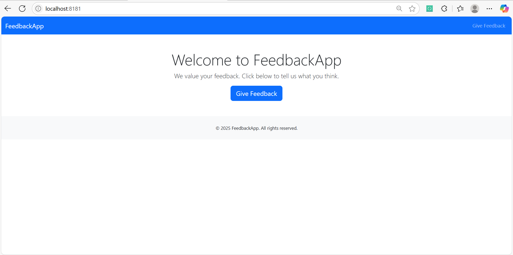
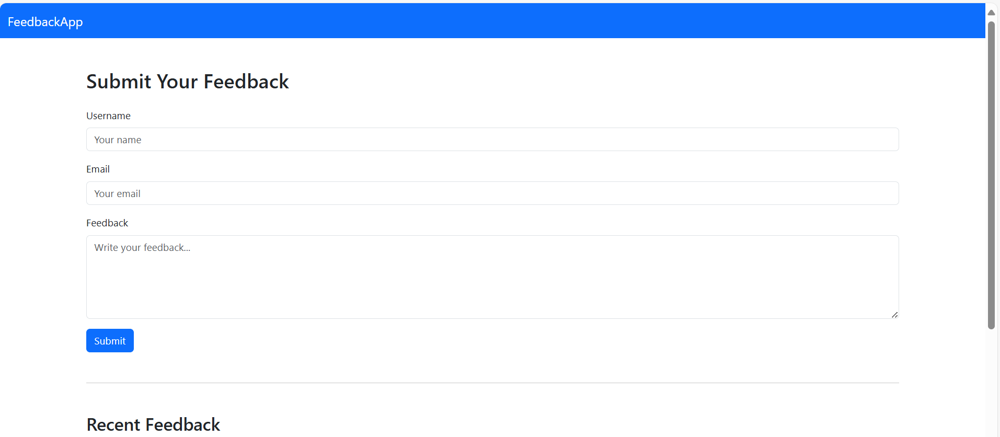

# 📘 Flask User Feedback Application

## 🧾 Project Overview

This is a simple **Flask web application** that allows users to submit feedback using a form. The feedback is displayed below the form and stored temporarily in memory (not in a database). It also uses **Bootstrap** for styling and includes **form validation**, **flash messages**, and a **custom 404 error page**.

---

## 📁 Project Structure

```
Flask-User-Interactions-Feebback-App/
│
├── main.py                # Main Flask application file
├── forms.py               # WTForms class for form validation
│
├── templates/             # Jinja2 templates for rendering HTML
│   ├── index.html         # Home page template
│   ├── feedback.html      # Feedback form template
│   └── 404.html           # Custom 404 error page template
│
├── .venv/                 # (Optional) Python virtual environment folder
├── requirements.txt       # Python package dependencies
└── README.md              # This file
```

---

## 🚀 How to Get Started (Step-by-Step)

#### 1. ✅ Prerequisites

Make sure you have the following installed:

* ✅ Python 3.8 or higher
* ✅ Internet access (to load Bootstrap from CDN)

---

#### 2. 💻 Setup the Project

**Step 1: Clone or download this project**

If you received it as a ZIP file, just extract it. Otherwise, run:

```bash
git clone https://github.com/jeetendra29gupta/Flask-User-Interactions-Feebback-App.git
cd Flask-User-Interactions-Feebback-App
```

**Step 2: Create a virtual environment**

```bash
python -m venv .venv
```

**Step 3: Activate the virtual environment**

* **Windows:**

  ```bash
  .venv\Scripts\activate
  ```

* **Mac/Linux:**

  ```bash
  source .venv/bin/activate
  ```

**Step 4: Install dependencies**

```bash
pip install -r requirements.txt
```

---

#### 3. 🚦 Run the App

In the terminal, run:

```bash
python main.py
```

You'll see something like:

```
Running on http://127.0.0.1:8181
```

Now open your browser and go to:

```
http://127.0.0.1:8181
```

You’ll see the **home page**, and you can click the “Give Feedback” button to test the form.

> Index/Home Page 

> Feedback Form 

---

### 📝 Features

* 🖋️ User feedback form
* ✅ Input validation (name, email, feedback required)
* 💬 Flash success/error messages
* 🧾 List of all submitted feedback (shown below the form)
* 🎨 Bootstrap UI styling
* 🧨 Custom 404 error page
* 🧠 Python, Flask, and Jinja2 used

---
